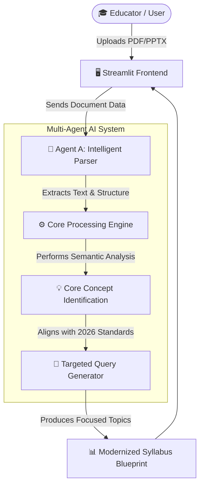

# 🌐 Universal Syllabus Researcher
### Modernizing any curriculum using Multi-Agent AI (2026 Standards)


---

## 🚀 Overview
The **Universal Syllabus Researcher** is an intelligent tool designed to parse, analyze, and modernize educational documents (PDFs and PPTXs) using cutting-edge AI. Driven by **Agent A (The Intelligent Parser)**, the system extracts core concepts and generates research-focused queries to align any curriculum with **2026 academic and technical standards**.


## 📸 Workflow Demo & Architecture


---

## ✨ Key Features
- **📄 Smart Parsing**: Automatically handles both PDF and PowerPoint (PPTX) document formats.
- **🧠 Agent A Intelligence**: Deep semantic analysis to identify the main subject and extract the top 5 core topics.
- **🎯 Future-Ready Queries**: Generates targeted research queries focused strictly on 2026 advancements.
- **🎨 Modern UI**: Clean, responsive Streamlit interface for a seamless and attractive user experience.

---

## 🛠️ Tech Stack
- **Frontend/App Framework**: Streamlit
- **AI Core**: Google Gemini (via `google-generativeai`)
- **Parsing Libraries**: `pypdf`, `python-pptx`
- **Environment Management**: `python-dotenv`

---

## 📥 Installation

1. **Clone the repository:**
   ```bash
   git clone https://github.com/initVD-007/Natural-Language-Processing.git
   cd Natural-Language-Processing
   ```

2. **Set up a Virtual Environment (Recommended):**
   ```bash
   python -m venv venv
   source venv/bin/activate  # On Windows use `venv\Scripts\activate`
   ```

3. **Install Dependencies:**
   ```bash
   pip install streamlit pypdf python-pptx google-generativeai python-dotenv
   ```

4. **Configure API Key:**
   Create a `.env` file in the root directory and add your Google API Key:
   ```env
   GOOGLE_API_KEY=your_gemini_api_key_here
   ```

---

## 🏃 Usage
Run the application using Streamlit:
```bash
streamlit run app.py
```
Open your browser and navigate to the local URL (usually `http://localhost:8501`). Upload your syllabus to begin the analysis!

---

## 📁 Directory Structure
```text
.
├── ai_researcher/          # Main Application Module
│   ├── app.py              # 🖥️ Main Streamlit Frontend
│   ├── parsers.py          # 🧠 Agent A (Parser Logic)
│   ├── auditor.py          # 🧐 Agent C (Auditor Logic)
│   ├── scout.py            # 🕵️ Agent B (Scout Logic)
│   ├── Dockerfile          # 🐳 Docker Container Config
│   └── docker-compose.yml  # 🏗️ Multi-container deployment
├── workflow_demo.png       # 📸 App Screenshot Demo
├── .gitignore              # Git Exclusion Rules
└── README.md               # 📖 Documentation
```

---

## 🤝 Contributing
Contributions are welcome! Feel free to open issues or submit pull requests to enhance the capabilities of the Syllabus Researcher.

---

## 📄 License
This project is open-source. Please check the license terms for more details.

---
# phase 1 completed...........
