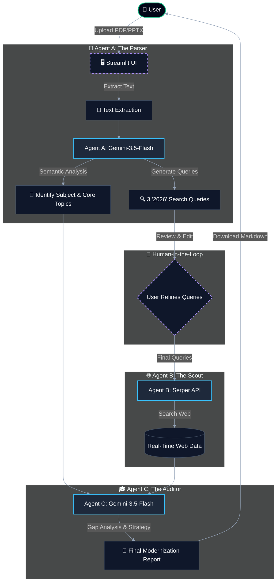

# 🌐 Universal Syllabus Researcher
### Modernizing any curriculum using Multi-Agent AI (2026 Standards)


---

## 🚀 Overview
The **Universal Syllabus Researcher** is an intelligent tool designed to parse, analyze, and modernize educational documents (PDFs and PPTXs) using cutting-edge AI. Driven by **Agent A (The Intelligent Parser)** and **Agent B (The Web Scout)**, the system extracts core concepts, generates research-focused queries, and autonomously scouts the web to align any curriculum with **2026 academic and technical standards**.

---

## ✨ Key Features
- **Smart Parsing**: Automatically handles both PDF and PowerPoint (PPTX) formats (up to 10MB limit).
- **Agent A Intelligence**: Deep semantic analysis to identify the main subject and extract top 5 core topics, using the robust `gemini-3-flash-preview` model with resilient exponential backoff.
- **Future-Ready Queries**: Generates targeted search queries focused on 2026 advancements.
- **Asynchronous Web Scouting**: Agent B securely and asynchronously scouts the web using Serper.dev APIs to rapidly gather current trends without Streamlit UI blocking.
- **Modern UI**: Clean, responsive Streamlit interface with smart caching to ensure fast consecutive analyses.

---

## 🛠️ Tech Stack
- **Frontend/App Framework**: Streamlit
- **AI Core**: Google Gemini (`google-generativeai`)
- **Web Search**: Serper API (`requests`, `json`)
- **Parsing Libraries**: `pypdf`, `python-pptx`
- **Resiliency**: Python `tenacity` library
- **Environment Management**: `python-dotenv`

---
## 🚀 Project Phases

### ✅ Phase 1: The AI Parser & Semantic Analyst (Agent A)
In this initial phase, the system successfully handles the foundation:
- **Document Ingestion:** Users seamlessly upload existing syllabus files (PDF/PPTX) via a clean Streamlit interface.
- **Semantic Analysis:** Powered by Google's Gemini-1.5-Flash, Agent A analyzes the extracted text to intelligently identify the main subjects and core topics of the course.
- **Targeted Query Generation:** The AI generates highly specific "2026" research queries based on the syllabus content, preparing the system for real-time industry scouting.

### ✅ Phase 2: The Web Scout (Agent B)
Building upon Phase 1, the system allows humans to review and refine queries before autonomously scouting the web for the latest industry standards:
- **Human-in-the-Loop:** Users can optionally edit the AI-generated queries to ensure they perfectly match their modernization goals.
- **Asynchronous Execution:** Agent B runs highly efficient asynchronous searches using Serper.dev APIs.
- **Real-Time Data Gathering:** Fetches the most recent and credible technical advancements, tools, and practices for each generated query.

### ✅ Phase 3: The Academic Auditor (Agent C)
The final stage synthesizes the parsed syllabus with the live web data to produce actionable insights:
- **Gap Analysis:** Agent C acts as a strict academic auditor, cross-referencing the original curriculum against the 2026 real-world tech stack data.
- **Comprehensive Reporting:** Generates a full markdown `Modernization Report` highlighting knowledge gaps, scoring current relevance, and building a strategic upgrade roadmap.
- **Export & Download:** Users can instantly download the tailored markdown report directly from the Streamlit interface.

---

## 🗺️ System Architecture Workflow



---

## 📥 Installation

1. **Clone the repository:**
   ```bash
   git clone https://github.com/initVD-007/Natural-Language-Processing.git
   cd Natural-Language-Processing
   ```

2. **Set up a Virtual Environment (Recommended):**
   ```bash
   python -m venv venv
   source venv/bin/activate  # On Windows use `venv\Scripts\activate`
   ```

3. **Install Dependencies:**
   ```bash
   pip install streamlit pypdf python-pptx google-generativeai python-dotenv
   ```

4. **Configure API Key:**
   Create a `.env` file in the root directory and add your Google API Key:
   ```env
   GOOGLE_API_KEY=your_gemini_api_key_here
   ```

---

## 🏃 Usage
Run the application using Streamlit:
```bash
streamlit run app.py
```
Open your browser and navigate to the local URL (usually `http://localhost:8501`). Upload your syllabus to begin the analysis!

---

## 🐳 Docker Deployment

The Universal Syllabus Researcher is fully containerized for easy deployment to platforms like Render, Railway, or Google Cloud Run.

### Using Docker Compose (Local Testing)
1. Ensure Docker Desktop is installed.
2. Ensure your `.env` file is configured with your API keys.
3. Run:
   ```bash
   docker-compose up --build
   ```
4. Access the app at `http://localhost:8501`.

---

## 📁 Directory Structure
```text
.
├── app.py              # Main Streamlit Application
├── parsers.py          # Agent A Implementation (Logic & AI)
├── .env                # API Keys (Git Ignored)
├── .gitignore          # Git Exclusion Rules
└── README.md           # Documentation
```

---

## 🤝 Contributing
Contributions are welcome! Feel free to open issues or submit pull requests to enhance the capabilities of the Syllabus Researcher.

---

## 📄 License
This project is open-source. Please check the license terms for more details.

---

